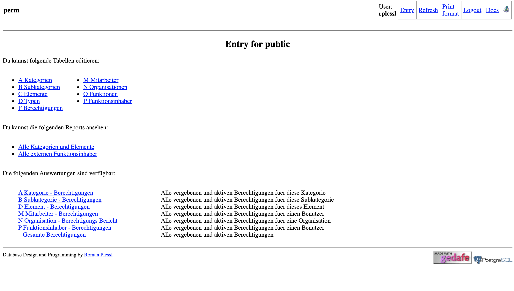

perm (the permission management system) 2.0
===========================================

Documentation
-------------

Perm is a web based permission management system based on the
gedafe toolkit (https://gedafe.github.com).
    

Homepage
--------

https://gitlab.com/prunux/perm

Screenshot
----------

License
-------

    Perm is a permission and access management system with RDMS.
    Copyright (C) 2015-2019, Stiftung 3FO, CH-4600 Olten
    Copyright (C) 2015-2019, Forem AG, CH-4600 Olten
    Copyright (C) 2015-2019, Roman Plessl (prunux.ch)

    This program is free software: you can redistribute it and/or modify
    it under the terms of the GNU General Public License as published by
    the Free Software Foundation, either version 3 of the License, or
    (at your option) any later version.

    This program is distributed in the hope that it will be useful,
    but WITHOUT ANY WARRANTY; without even the implied warranty of
    MERCHANTABILITY or FITNESS FOR A PARTICULAR PURPOSE.  See the
    GNU General Public License for more details.

    You should have received a copy of the GNU General Public License
    along with this program.  If not, see <http://www.gnu.org/licenses/>.

Copyright
---------

    Copyright (c) 2015-2019 Stiftung 3FO, Olten, All rights reserved.
    Copyright (c) 2015-2019 Plessl + Burkhardt GmbH, All rights reserved.
    
    This database design and code was donated and paid by 

        Stiftung 3FO, Belchenstrasse 7, CH-4600 Olten and
        Forem AG, Belchenstrasse 7, CH-4600 Olten

Authors
-------

* Roman Plessl